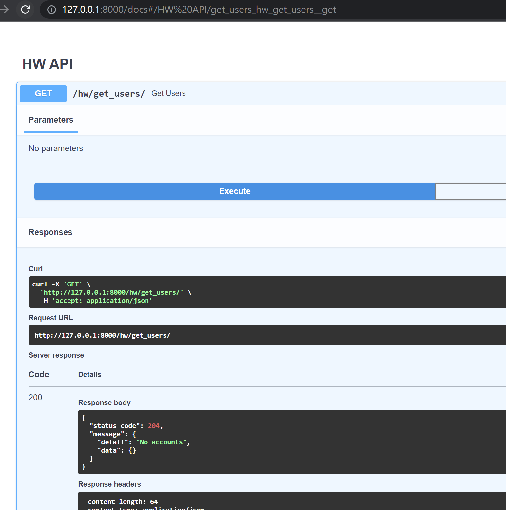
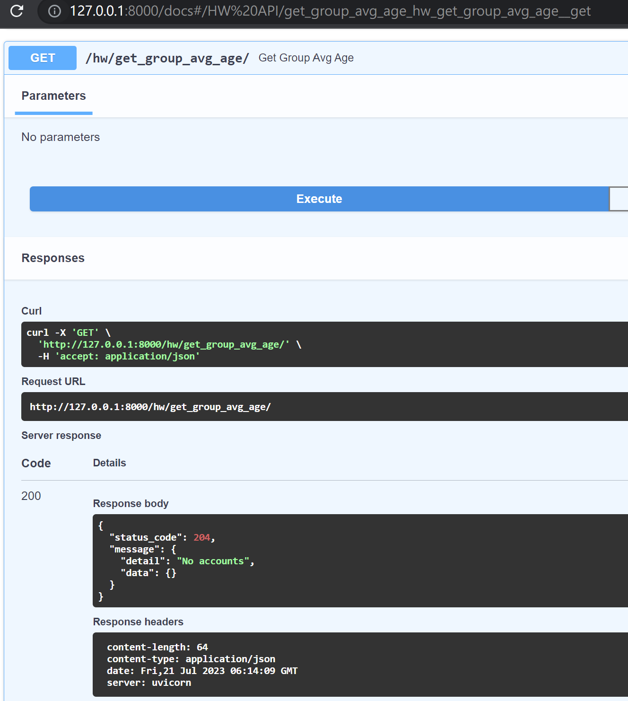
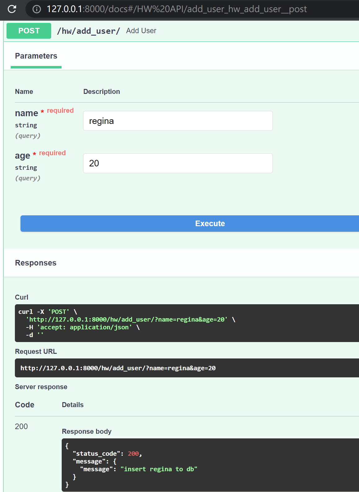
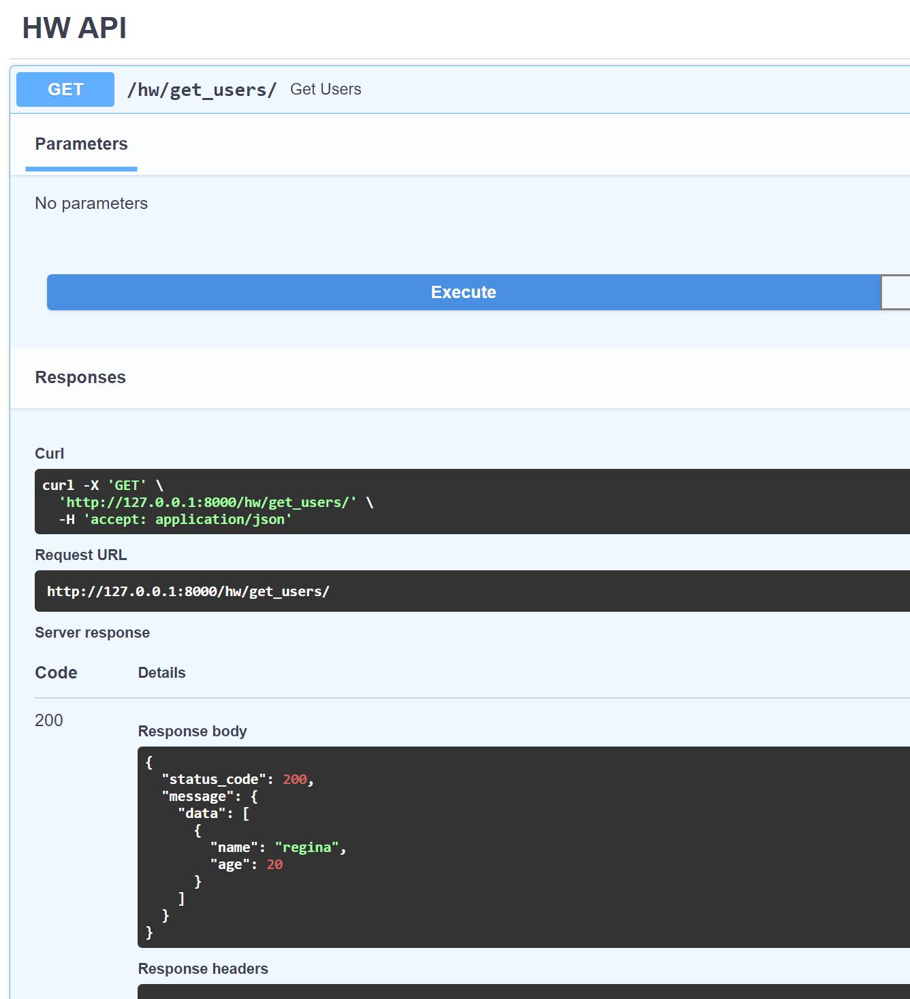
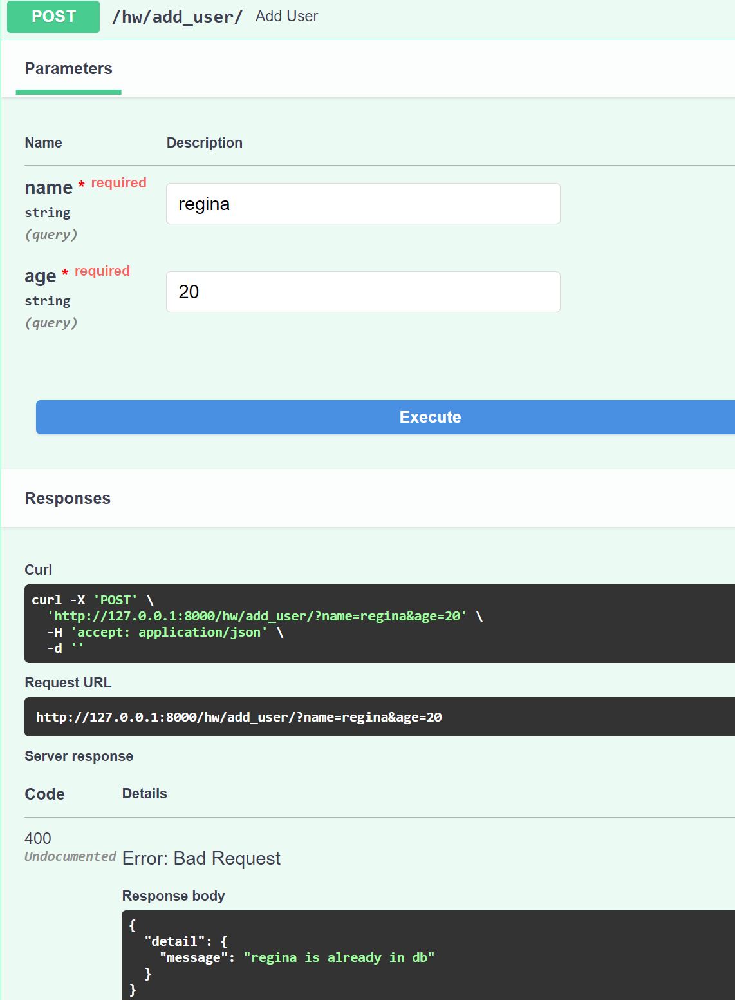
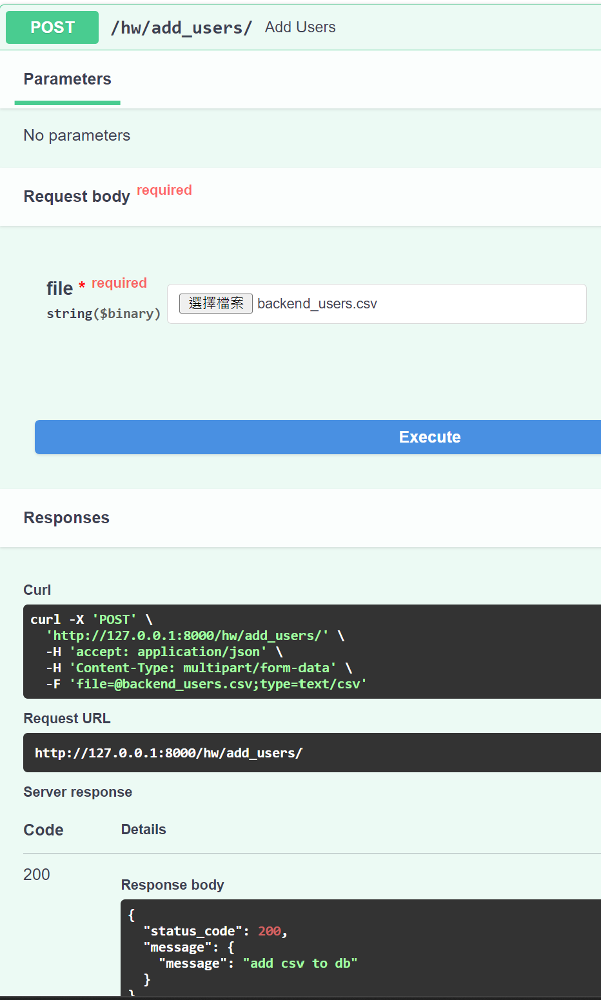
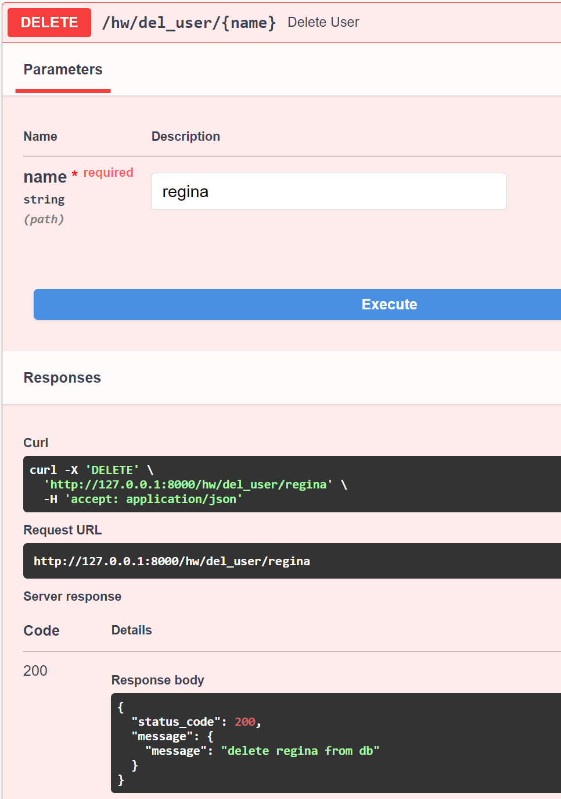
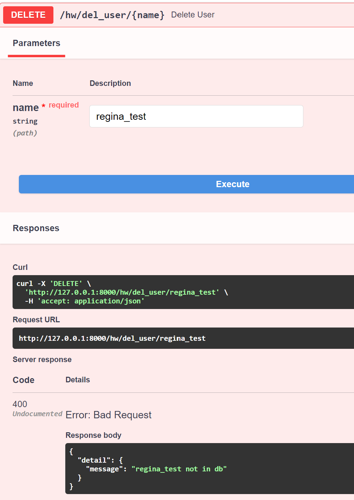

# 目錄
- [專案目的](#專案目的)
- [專案架構](#專案架構)
- [Quickstart](#quickstart)
- [API測試](#api測試)

## 專案目的

Multiple services that would like to access data with RESTful API.

## 專案架構

- core/ 邏輯層
- data/ 存放資料，例如csv
- db/ 連資料庫的相關功能
- docs/ 專案相關的文檔
- routers/ API的分層與設計
- tests/ 測試檔案，對程式的單元測試或API測試
- config_dev.yml 專案相關設定檔
- environment.yml 專案環境資訊
- main.py 專案的入口點
- README.md
- utils.py 一些小功能

## Quickstart

0. git clone https://github.com/weilingpan/Practice.git
0. 進入專案目錄 cd practice
0. 建立虛擬環境 conda env create -f environment.yml
0. 進入虛擬環境 conda activate pegatron
0. 啟動FastAPI服務 uvicorn main:app --reload
0. 在瀏覽器中打開 http://localhost:8000/docs 可以看到 API 文件

## API測試

以下使用 Swagger 為例，使用 Postman 可以參考 docs postman_*.png 的圖檔。

1. [Get] get_users
因尚未建立任何 account，因此data回傳空的 {}

2. [Get] get_group_avg_age
同理，因尚未建立任何 account，因此data回傳空的 {}

3. [Post] add_user
建立一個user

4. [Get] get_users
再次檢查 get_user 便能取到資料

5. [Post] add_user
剛剛建立了一個name為regina的用戶，如果我再建立一次會出現以下錯誤。

6. [Post] add_users
目前提供上傳csv格式的用戶資料

7. [Delete] del_user
刪除用戶

8. [Delete] del_user
如果用戶不存在，會顯示以下錯誤

